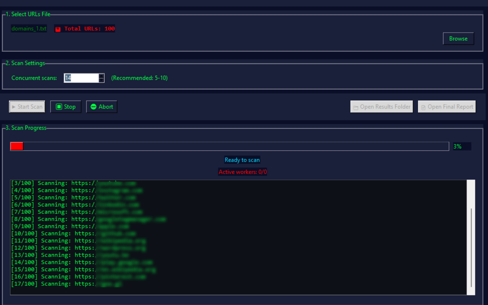

# 🚀 AutoXSS-Detector  

### Advanced Automated XSS Scanner with GUI + Smart Reporting

Cross-Site Scripting (**XSS**) is a common and dangerous web vulnerability that allows attackers to inject malicious JavaScript into web pages viewed by others.  
It can lead to:

- Credential theft  
- Session hijacking  
- Phishing  
- Website defacement  
- Complete browser compromise  

Testing large batches of URLs manually for XSS is slow and repetitive — that’s where **AutoXSS-Detector** comes in.

---

# 🛡 What Is AutoXSS-Detector?

AutoXSS-Detector is a **GUI-based automated XSS scanning framework** that performs multi-threaded scanning using the xsscrapy engine.  
It loads URLs from a file, tests them in parallel, parses the scan results, removes duplicates, and generates a clean, structured final report.

Designed for:

- Bug bounty hunters  
- Web security analysts  
- Pentesters  
- Security automation workflows  

---

# ✨ Features

### 🔍 1. **Fully Automated XSS Scanning**
Load a `.txt` file of URLs → click **Start Scan** → everything runs automatically.

### ⚡ 2. **High-Speed Multi-Threading**
- Up to 20 parallel workers  
- Ideal for large URL lists  
- Timeout handling for slow URLs  

### 🧪 3. **Smart Result Extraction**
Parses xsscrapy output and extracts:

- Payload  
- URL  
- Response URL  
- Injection point  
- Possible payloads  
- Reflection confirmation  

### 🧹 4. **Automatic Duplicate Removal**
Automatically groups and removes duplicate findings using: Host + Path + Injection Point
Ensures **clean, unique** results.

### 📄 5. **Professional Final Report**
Generates: xss_final_report.txt
Including:
- Unique injection points  
- Full payload details  
- Summaries & statistics  

### 🎨 6. **Modern GUI**
- Dark cyberpunk theme  
- Live logs  
- Progress bars  
- Worker activity indicators  

### 🧩 7. **Auto Organizes Output**
Creates a timestamped folder:
xss_scan_results_YYYYMMDD_HHMMSS/
├── xss_final_report.txt
└── xsscrapy_outputs/

# 🔧 Workflow
```bash
┌──────────────────────────────────────────┐
│        1. Load URLs File (.txt)          │
└──────────────────────────┬───────────────┘
                           │
                           ▼
┌──────────────────────────────────────────┐
│        2. Start Scan (Multi-Thread)      │
│         Auto-launches xsscrapy           │
└──────────────────────────┬───────────────┘
                           │
                           ▼
┌──────────────────────────────────────────┐
│      3. Capture & Collect Results        │
│       (xsscrapy output files)            │
└──────────────────────────┬───────────────┘
                           │
                           ▼
┌──────────────────────────────────────────┐
│       4. Parse & Deduplicate Data        │
│    Extract: Payload, URL, response,      │
│       injection point + remove dups      │
└──────────────────────────┬───────────────┘
                           │
                           ▼
┌──────────────────────────────────────────┐
│         5. Generate Final Report         │
│       (Clean → xss_final_report.txt)     │
└──────────────────────────────────────────┘
```

# 💡 Why AutoXSS-Detector Is Unique

| Feature | AutoXSS-Detector | Typical Tools |
|--------|------------------|----------------|
| GUI interface | ✅ | ❌ |
| Multi-threading | ✅ Fast | ⚠ Slow |
| Deduplication engine | ✅ | ❌ |
| Auto final report | ✅ | ❌ |
| Organized output | ✅ | ❌ |
| Real-time logs | ✅ | ⚠ Minimal |

This tool is built specifically for **automation**, **speed**, and **clean reporting** — perfect for large-scale XSS analysis.

📦 Installation Steps (For Users)

Steps (For Users)
## 🔧 Installation Guide

Follow these steps to install and run **AutoXSS-Detector** on your system.

---

## 1️⃣ Install Python 3.8+  
Make sure Python is installed:  

```bash
python --version
```
If not installed, download it from:
https://www.python.org/downloads/

2️⃣ Clone the Repository
```bash
git clone https://github.com/satyamss07/AutoXSS-Detector.git
cd AutoXSS-Detector
```
3️⃣ Install Required Python Packages
Install dependencies from requirements.txt:
```bash
pip install -r requirements.txt
```
4️⃣ Install xsscrapy (Required Engine)
```bash
pip install xsscrapy
```
If xsscrapy requires lxml on your system, install:
```bash
pip install lxml
```
5️⃣ Run AutoXSS-Detector
```bash
python AutoXSS-Detector.py
```
This will open the GUI interface.

6️⃣ Load URLs File
Prepare a .txt file like:
```bash
https://example.com/?id=1
https://test.com/search?q=test
```
Then load it using the Browse button.

7️⃣ Start Scan
Click:
```bash
▶ Start Scan
```
The tool will:

-Run multi-threaded XSS scanning,
-Collect results,
-Parse & remove duplicates,
-Generate a final report

8️⃣ View Output Reports

After completion, open the generated folder:
```bash
xss_scan_results_YYYYMMDD_HHMMSS/
```
Inside it you will find:
```bash
xss_final_report.txt
xsscrapy_outputs/
```
🎉 Done!

You are now ready to analyze XSS vulnerabilities with full automation.

## ✅ Tips & Notes

- Make sure you are using **Python 3.8+** for best compatibility.  
- All required dependencies are listed in **requirements.txt** — install them using:  
  ```bash
  pip install -r requirements.txt
  ```
  This tool uses xsscrapy as its scanning engine, so ensure it is installed:
  ```bash
  pip install xsscrapy
  ```
  When scanning large URL lists, the multi-threaded scanning engine significantly improves performance compared to manual or single-threaded scanning.


